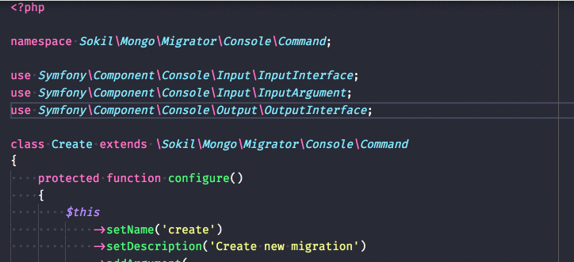

# php-import-checker

php-import-checker helps you know when a given class is imported but not used, providing a easy way to keep your code clean and organized.

## Features

- Highlight every unused class that is imported with `use`

For example if there is an image subfolder under your extension project workspace:

## Requirements

Visual Code 1.14 +

### 0.0.1

- Ability to see unused imports in the PHP class
